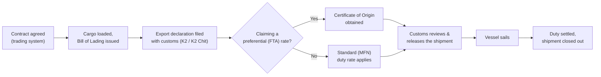

# 🧭 Trade Compliance & Customs Analytics Control Tower

**A portfolio project demonstrating how fragmented trading, logistics, ERP and trading-risk data can be consolidated into a customs readiness & trade-risk control tower — built for Customs/Trade Data Analyst and Analytics Engineer roles.**

> ⚠️ **All data in this repository is synthetically generated.** Contract references, counterparties, vessels, quantities, prices, tariff rates and FTA schemes are randomly simulated for demonstration purposes only. Nothing here is extracted from, or represents, any real employer's production systems, credentials, or infrastructure. Duty and FTA figures are illustrative proxies and would require Customs/Trade Compliance SME validation before any real business use.

**[▶ Open the live dashboard](https://haniwork.github.io/custom_analytics/)**

---

## Contents

1. [Objective](#1-objective)
2. [Customs Process at a Glance](#2-customs-process-at-a-glance)
3. [Source Systems Modeled (synthetic)](#3-source-systems-modeled-synthetic)
4. [Dashboard Pages](#4-dashboard-pages)
5. [Pipeline Architecture](#5-pipeline-architecture)
6. [Data Model](#6-data-model)
7. [Repo Structure](#7-repo-structure)
8. [Running It Locally](#8-running-it-locally)
9. [Glossary](#9-glossary)
10. [License](#10-license)

---

## 1. Objective

**Monitor and analyze customs process compliance by pulling data from a handful of disconnected source systems into one integrated model.**

Most commodity trading organizations don't run a dedicated customs platform (e.g. SAP GTS). Their customs-relevant data instead lives scattered across a trading/contract system, a logistics document tracker, an ERP product master, and a risk system — four systems, four owners, none of them built with customs analytics in mind. This project builds a small ETL pipeline that extracts from all four, models them as one dataset, and surfaces the result as KPI scorecards and dashboards covering documentation compliance, HS code governance, duty analysis, FTA/duty optimization, and trade risk performance — the same kind of KPI reporting, dashboard management, and performance monitoring a global customs analytics function runs day to day.

## 2. Customs Process at a Glance

*For readers outside supply chain / customs: here's what actually has to happen, end to end, before a shipment is considered compliant. Every box below is a checkpoint that produces a document, a status flag, or a monetary figure in the data model that follows.*



The catch: those checkpoints don't all live in one system. The contract terms sit in a trading platform, the loading/declaration/document trail sits in a logistics control tower, the product's HS classification sits in an ERP master, and the financial exposure sits in a risk platform. **Section 3** is exactly that: the four source systems this project models, and why joining them is a real integration problem, not just a JOIN clause.

## 3. Source Systems Modeled (synthetic)

| Role | What it typically holds |
|---|---|
| **Trading / Contract system** | Contract terms, counterparties, product, quantity, price, Incoterm, payment term, vessel, load/discharge port, BL date & quantity, LC details |
| **Logistics Control Tower** | Stage-gated workflow over sales orders (order receipt → gate-in/out → customs handover → vessel sailed), and the mandatory document set per shipment (K2, K2 Chit, Certificate of Origin, Bill of Lading, Customs Release, Customs Official Receipt, Shipment Tender, LOI) |
| **ERP / Commodity Code Master** | Product classification, HS/commodity codes, classification validity windows, reclassification history |
| **Trading Risk Platform** | Open position, mark-to-market, Value-at-Risk, and limit utilization per contract |

All four are generated as independent synthetic extracts and then joined the way a real ETL pipeline would join them — by contract reference, sales order, or shipment ID — which is the same source-to-target mapping problem a real customs control tower would face: inconsistent keys, different field names for the same business concept, and partial coverage across systems.

## 4. Dashboard Pages

Every page opens with a **scorecard**: a row of KPI tiles, each carrying an explicit RAG status pill (On Target / Watch / At Risk), not just a colored number — matching how customs teams actually track performance (monthly reports, dashboards, scorecards, management presentations). Page 1's scorecard is a roll-up of one headline metric from each of the other six pages, so the exec summary reads as a scorecard-of-scorecards; click any tile to jump straight to that page.

| # | Page | Purpose |
|---|---|---|
| 1 | **Executive Trade Overview** | Contract value, volume, and mix by product / counterparty / Incoterm / port |
| 2 | **Customs Documentation Compliance** | K2, COO, BL, Customs Release/Receipt completion %, missing-document counts, stage-gate backlog |
| 3 | **Shipment & BL Monitoring** | Missing BL dates, quantity variance exceptions, shipments stuck before final stage, LC-vs-BL backdating checks |
| 4 | **HS Code / Commodity Code Governance** | HS coverage %, missing/expired classifications, high-volume products without HS codes |
| 5 | **Duty / Freight Exposure Proxy** *(illustrative)* | Freight, port cost and estimated duty as a % of invoice value, by product and by lane |
| 6 | **FTA / Certificate of Origin Opportunity** *(illustrative)* | COO completion, FTA-eligible shipments missing COO, estimated preferential-duty savings opportunity; plus a shipment-level HS Code + FTA optimization table (Country of Origin per Rules of Origin, destination, HS code, duty paid, FTA availability looked up from an origin–destination–HS reference table, and the resulting saving opportunity) |
| 7 | **Trade Risk Score** | A composite Red/Amber/Green score combining missing documents, missing HS codes, missing/expired LCs, and high risk-limit utilization |

Pages 5 and 6 are explicitly labeled as **illustrative proxies** in the dashboard itself — the point is to demonstrate the analytical framework, not to assert real tariff/duty figures.

### Trade Risk Score logic

```
risk_score =
    + 1 if K2 missing
    + 1 if K2 Chit missing
    + 1 if Certificate of Origin missing
    + 1 if Bill of Lading missing
    + 1 if HS code missing
    + 1 if LC required but missing
    + 1 if risk-limit utilization >= 80%

RAG:  0–1 = Green   2–3 = Amber   4+ = Red
```

## 5. Pipeline Architecture

Modeled on a standard Azure medallion architecture (bronze → silver → gold):

```
Source systems (Trading / Logistics / ERP / Risk / Reference tariff table)
        │
        ▼
Azure Data Factory  ──  ingest raw extracts
        │
        ▼
ADLS Gen2  (Bronze)  ──  raw CSV / Excel / SQL extracts
        │
        ▼
Azure Databricks  ──  clean, standardize, validate, join, derive flags
        │
        ▼
ADLS Gen2  (Silver / Gold)  ──  curated trade & customs model
        │
        ▼
Azure Synapse  ──  SQL serving views
        │
        ▼
Power BI / Web dashboard  ──  KPIs & storytelling
```

In this repo, the same layering is implemented as a Python/pandas ETL job (Bronze → Silver → Gold), and the Gold layer feeds a self-contained interactive HTML dashboard instead of a `.pbix`, so it's viewable directly in a browser with no software install — see [`/dashboard`](dashboard/index.html).

- **Bronze** — raw synthetic source extracts, one file per source system, untouched
- **Silver** — cleaned & standardized: harmonized field names, typed dates, derived booleans (`bl_available`, `has_hs_code`, `lc_backdated_vs_bl`, …)
- **Gold** — business-ready, dashboard-facing aggregates and KPIs, one JSON per dashboard page

## 6. Data Model

Grain: **one row = one shipment.**

```
Fact_TradeShipment
 ├─ Contract Ref, Sales Order, Shipment ID
 ├─ Product Key, Counterparty Key, Date Key
 ├─ Quantity MT, Invoice Amount, Freight Cost, Duty Cost
 └─ BL Date, Incoterm, Payment Term

Dim_Product          Dim_Counterparty        Dim_Logistics
 ├─ Material Code      ├─ Counterparty         ├─ Load / Discharge Port
 ├─ Product            ├─ Broker               ├─ Vessel
 ├─ HS Code            └─ Country              ├─ Incoterm / Payment Term
 └─ HS Valid From/To                            └─ Mode of Transport

Fact_DocumentCompliance          Fact_RAVEExposure
 ├─ Shipment ID                   ├─ Contract Ref, Product
 ├─ K2 / K2 Chit / COO / BL /     ├─ Open Position, M2M, VaR
 │  COR / LOI flags               └─ Limit Utilization %
 └─ OCR Confidence Level
```

A star schema in spirit — one fact table at shipment grain, surrounded by conformed dimensions (product, counterparty, logistics) — plus two satellite fact tables (document compliance, risk exposure) joined back on shipment/contract keys. Full field-level lineage is in [`docs/data_dictionary.md`](docs/data_dictionary.md).

## 7. Repo Structure

```
trade-compliance-customs-control-tower/
├── README.md
├── requirements.txt
├── .github/workflows/pages.yml   publishes dashboard/ to GitHub Pages on every push to master
├── data/
│   ├── bronze/     raw synthetic source extracts (per system)
│   ├── silver/     cleaned, standardized tables
│   └── gold/       business-ready KPI tables (JSON + CSV) feeding the dashboard
├── scripts/
│   ├── generate_bronze_data.py   creates the synthetic source data
│   └── build_silver_gold.py      runs the Bronze → Silver → Gold transform + KPI/risk scoring
├── dashboard/
│   ├── index_template.html       dashboard shell (Plotly.js, vanilla JS)
│   ├── plotly.min.js             vendored Plotly.js (no CDN dependency at runtime)
│   ├── data.json                 Gold-layer data bundle embedded into the dashboard
│   └── index.html                final, self-contained dashboard (open directly, or serve via GitHub Pages)
└── docs/
    └── data_dictionary.md        field-level reference for every table
```

## 8. Running It Locally

```bash
python3 -m venv venv && source venv/bin/activate
pip install -r requirements.txt

python scripts/generate_bronze_data.py     # regenerate synthetic bronze extracts
python scripts/build_silver_gold.py        # rebuild silver/gold + dashboard/data.json

# then rebuild the static dashboard (inlines Plotly.js + the data bundle,
# so the result is a single self-contained file with no CDN dependency):
python3 -c "
data = open('dashboard/data.json').read()
plotly_js = open('dashboard/plotly.min.js').read()
tpl = open('dashboard/index_template.html').read()
out = tpl.replace('__PLOTLY_JS__', plotly_js).replace('__DATA_JSON__', data)
open('dashboard/index.html', 'w').write(out)
"
```

Open `dashboard/index.html` directly in a browser, or enable **GitHub Pages** on this repo to get a shareable link. GitHub Pages' "Deploy from a branch" mode only supports `/ (root)` or `/docs` as the folder — it can't point at `/dashboard` — so this repo instead ships a `.github/workflows/pages.yml` workflow that publishes the `dashboard/` folder via GitHub Actions. To enable it: **Settings → Pages → Source: GitHub Actions** (no branch/folder picker needed — the workflow runs automatically on every push to `master`).

## 9. Glossary

- **Customs vs. Duty vs. Levy** — Customs is the government process controlling cross-border goods movement; duty is the tax on imported/exported goods; a levy is a broader government charge, not always customs-related.
- **K2** — Malaysia's export customs declaration form, evidence goods were declared to customs.
- **BL (Bill of Lading)** — proof of loading, contract of carriage, and document of title.
- **LOI (Letter of Indemnity)** — a legal undertaking to compensate a party for losses arising from a non-standard instruction (e.g. releasing cargo before the original BL is available).
- **LC (Letter of Credit)** — a bank payment undertaking, paid when documents comply with the LC's terms.
- **TT (Telegraphic Transfer)** — a bank-to-bank payment.
- **Turnover / Revenue / Sales** — used interchangeably.
- **Profit vs. Margin** — profit is an amount; margin is a percentage.

## 10. License

MIT — see [LICENSE](LICENSE). Synthetic data only; no warranty of accuracy or fitness for real customs/tariff decision-making.

---

Built by **Hani Ihsanuddin** · [LinkedIn](https://linkedin.com/in/haniihsanuddin) · haniihsanuddin@gmail.com
